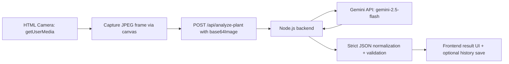

# Plant Health AI Handoff for Node.js + HTML Camera App

This document is the exact handoff you can give to your Node.js app agent to implement the same AI plant diagnosis pipeline used in this React Native app.

## 1) Goal

Implement end-to-end flow:

1. Camera feed in browser (HTML frontend)
2. Capture a frame as JPEG
3. Send base64 image to Node.js backend
4. Backend calls Gemini vision model
5. Backend returns strict JSON diagnosis
6. Frontend displays diagnosis and optionally stores history

## 2) Exact AI Model and Output Contract (must match)

Use:

- SDK: `@google/generative-ai`
- Model: `gemini-2.5-flash`
- Input image mime type: `image/jpeg`

Expected response shape:

```json
{
  "plantName": "Common name of the plant (or 'Unknown/Not a plant' if not applicable)",
  "scientificName": "Scientific name of the plant (or 'N/A')",
  "soilCondition": "Dry / Damp / Wet / Good condition (choose the most accurate one)",
  "plantHealthRating": 0,
  "healthStatus": "Good / Dry / Sunburned / Overwatered / Diseased / Unknown",
  "detailedAnalysis": "A concise paragraph (2-3 sentences) explaining visual findings.",
  "careAdvice": [
    "Actionable care tip 1",
    "Actionable care tip 2",
    "Actionable care tip 3"
  ]
}
```

Field rules:

- `plantHealthRating` must be a number from 0 to 100.
- `careAdvice` must be an array of strings (recommended length: 3).
- Return JSON only (no markdown code fences).

## 3) Prompt to Use (copy exactly)

```text
Analyze this image of a plant and its soil/surroundings.
Determine the plant name, health status, and soil condition.

Please return a JSON object with the following fields:
{
  "plantName": "Common name of the plant (or 'Unknown/Not a plant' if not applicable)",
  "scientificName": "Scientific name of the plant (or 'N/A')",
  "soilCondition": "Dry / Damp / Wet / Good condition (choose the most accurate one)",
  "plantHealthRating": 0-100 (a percentage score of the overall plant health),
  "healthStatus": "Good / Dry / Sunburned / Overwatered / Diseased / Unknown",
  "detailedAnalysis": "A concise paragraph (2-3 sentences) explaining the visual findings, including leaf condition, soil appearance, and any signs of pests, discoloration, or watering issues.",
  "careAdvice": [
    "Actionable care tip 1",
    "Actionable care tip 2",
    "Actionable care tip 3"
  ]
}

IMPORTANT: Return ONLY the raw JSON string inside your response. Do not enclose it in markdown formatting like ```json.
```

## 4) Reference Architecture



## 5) Backend Implementation (Node.js / Express)

### 5.1 Install dependencies

```bash
npm install express cors dotenv @google/generative-ai
```

### 5.2 Environment variables

Create `.env`:

```env
PORT=3000
GEMINI_API_KEY=YOUR_GEMINI_API_KEY
```

### 5.3 AI service file

Create `src/services/geminiPlantAnalyzer.js`:

```js
const { GoogleGenerativeAI } = require('@google/generative-ai');

function sanitizeAndParseGeminiJson(rawText) {
  const cleanText = String(rawText || '').replace(/```json|```/g, '').trim();
  return JSON.parse(cleanText);
}

function normalizeResult(obj) {
  return {
    plantName: typeof obj.plantName === 'string' ? obj.plantName : 'Unknown/Not a plant',
    scientificName: typeof obj.scientificName === 'string' ? obj.scientificName : 'N/A',
    soilCondition: typeof obj.soilCondition === 'string' ? obj.soilCondition : 'Unknown',
    plantHealthRating: Number.isFinite(Number(obj.plantHealthRating))
      ? Math.max(0, Math.min(100, Number(obj.plantHealthRating)))
      : 0,
    healthStatus: typeof obj.healthStatus === 'string' ? obj.healthStatus : 'Unknown',
    detailedAnalysis: typeof obj.detailedAnalysis === 'string' ? obj.detailedAnalysis : '',
    careAdvice: Array.isArray(obj.careAdvice)
      ? obj.careAdvice.map((x) => String(x)).filter(Boolean).slice(0, 5)
      : []
  };
}

async function analyzePlantImage(base64Image, apiKey) {
  if (!apiKey) {
    throw new Error('Gemini API key missing on server. Set GEMINI_API_KEY.');
  }

  const prompt = `Analyze this image of a plant and its soil/surroundings.
Determine the plant name, health status, and soil condition.

Please return a JSON object with the following fields:
{
  "plantName": "Common name of the plant (or 'Unknown/Not a plant' if not applicable)",
  "scientificName": "Scientific name of the plant (or 'N/A')",
  "soilCondition": "Dry / Damp / Wet / Good condition (choose the most accurate one)",
  "plantHealthRating": 0-100 (a percentage score of the overall plant health),
  "healthStatus": "Good / Dry / Sunburned / Overwatered / Diseased / Unknown",
  "detailedAnalysis": "A concise paragraph (2-3 sentences) explaining the visual findings, including leaf condition, soil appearance, and any signs of pests, discoloration, or watering issues.",
  "careAdvice": [
    "Actionable care tip 1",
    "Actionable care tip 2",
    "Actionable care tip 3"
  ]
}

IMPORTANT: Return ONLY the raw JSON string inside your response. Do not enclose it in markdown formatting like \`\`\`json.`;

  const genAI = new GoogleGenerativeAI(apiKey);
  const model = genAI.getGenerativeModel({ model: 'gemini-2.5-flash' });

  const imagePart = {
    inlineData: {
      data: base64Image,
      mimeType: 'image/jpeg'
    }
  };

  const result = await model.generateContent([prompt, imagePart]);
  const responseText = result.response.text();

  let parsed;
  try {
    parsed = sanitizeAndParseGeminiJson(responseText);
  } catch (err) {
    const e = new Error('Failed to parse model response as JSON.');
    e.rawResponse = responseText;
    throw e;
  }

  return normalizeResult(parsed);
}

module.exports = { analyzePlantImage };
```

### 5.4 API route

Create `src/routes/analyzePlant.js`:

```js
const express = require('express');
const { analyzePlantImage } = require('../services/geminiPlantAnalyzer');

const router = express.Router();

router.post('/analyze-plant', async (req, res) => {
  try {
    const { base64Image } = req.body || {};

    if (!base64Image || typeof base64Image !== 'string') {
      return res.status(400).json({ message: 'base64Image is required.' });
    }

    const analysis = await analyzePlantImage(base64Image, process.env.GEMINI_API_KEY);

    return res.status(200).json({
      ok: true,
      analysis,
      timestamp: new Date().toISOString()
    });
  } catch (err) {
    return res.status(500).json({
      ok: false,
      message: err.message || 'Failed to analyze plant image.',
      rawResponse: err.rawResponse || undefined
    });
  }
});

module.exports = router;
```

### 5.5 Server entry

Create/update `src/server.js`:

```js
require('dotenv').config();
const express = require('express');
const cors = require('cors');
const analyzePlantRouter = require('./routes/analyzePlant');

const app = express();

app.use(cors());
app.use(express.json({ limit: '15mb' }));

app.get('/health', (_req, res) => {
  res.json({ ok: true, service: 'plant-health-ai', time: new Date().toISOString() });
});

app.use('/api', analyzePlantRouter);

const port = Number(process.env.PORT || 3000);
app.listen(port, () => {
  console.log(`Server running on port ${port}`);
});
```

## 6) HTML Frontend Camera Flow

Use browser camera and send one captured frame.

```html
<video id="video" autoplay playsinline></video>
<canvas id="canvas" style="display:none;"></canvas>
<button id="captureBtn">Analyze Plant</button>
<pre id="result"></pre>

<script>
  const video = document.getElementById('video');
  const canvas = document.getElementById('canvas');
  const resultEl = document.getElementById('result');
  const captureBtn = document.getElementById('captureBtn');

  async function startCamera() {
    const stream = await navigator.mediaDevices.getUserMedia({
      video: {
        facingMode: 'environment',
        width: { ideal: 1280 },
        height: { ideal: 720 }
      },
      audio: false
    });
    video.srcObject = stream;
  }

  function captureFrameAsBase64Jpeg() {
    const w = video.videoWidth || 1280;
    const h = video.videoHeight || 720;

    canvas.width = w;
    canvas.height = h;

    const ctx = canvas.getContext('2d');
    ctx.drawImage(video, 0, 0, w, h);

    const dataUrl = canvas.toDataURL('image/jpeg', 0.92);
    return dataUrl.split(',')[1];
  }

  async function analyzeCurrentFrame() {
    resultEl.textContent = 'Analyzing...';

    const base64Image = captureFrameAsBase64Jpeg();

    const res = await fetch('http://localhost:3000/api/analyze-plant', {
      method: 'POST',
      headers: { 'Content-Type': 'application/json' },
      body: JSON.stringify({ base64Image })
    });

    const data = await res.json();

    if (!res.ok || !data.ok) {
      resultEl.textContent = JSON.stringify(data, null, 2);
      return;
    }

    resultEl.textContent = JSON.stringify(data.analysis, null, 2);
  }

  captureBtn.addEventListener('click', analyzeCurrentFrame);
  startCamera().catch((err) => {
    resultEl.textContent = 'Camera error: ' + err.message;
  });
</script>
```

## 7) Optional: Continuous Prediction from Live Feed

If you want repeated predictions from live camera feed:

- Capture one frame every 2 to 5 seconds.
- Do not send every video frame (too expensive and unnecessary).
- Use an in-flight lock so only one request runs at a time.
- Keep the latest successful result in UI.

Pseudo logic:

```js
let busy = false;
setInterval(async () => {
  if (busy) return;
  busy = true;
  try {
    const base64Image = captureFrameAsBase64Jpeg();
    await callAnalyzeApi(base64Image);
  } finally {
    busy = false;
  }
}, 3000);
```

## 8) Mock Mode (Optional, but useful)

Implement a mock toggle in backend or frontend so you can test UI quickly without API usage.

Return sample object with same schema as `analysis`.

## 9) Data Storage (Optional)

If you want history parity with mobile app, store each scan as:

```json
{
  "id": "timestamp_or_uuid",
  "date": "ISO timestamp",
  "imageUri": "data:image/jpeg;base64,... (optional)",
  "plantName": "...",
  "scientificName": "...",
  "soilCondition": "...",
  "plantHealthRating": 0,
  "healthStatus": "...",
  "detailedAnalysis": "...",
  "careAdvice": ["...", "...", "..."]
}
```

## 10) Security and Reliability

- Never expose Gemini API key in frontend code.
- Keep API key only on backend via env vars.
- Limit JSON body size (`express.json({ limit: '15mb' })`).
- Validate `base64Image` presence and type.
- Catch and log raw model output only on server side.
- Add basic request rate limiting in production.

## 11) Quick Verification Checklist

1. `GET /health` returns `{ ok: true, ... }`
2. Camera preview opens in browser
3. Clicking Analyze sends one frame
4. Backend returns `analysis` object with all required fields
5. `plantHealthRating` is numeric and clamped `0..100`
6. UI renders `careAdvice` array safely

## 12) One-shot Agent Prompt (you can paste this to your Node.js app agent)

```text
Implement plant health AI inference in my existing Node.js backend + HTML camera frontend.

Requirements:
1) Use @google/generative-ai with model gemini-2.5-flash.
2) Add POST /api/analyze-plant that accepts { base64Image }.
3) Send prompt exactly as provided in my handoff file and image mimeType image/jpeg.
4) Parse model response JSON; strip optional markdown wrappers; normalize schema fields.
5) Return { ok: true, analysis, timestamp }.
6) Add camera capture flow in frontend: getUserMedia -> canvas JPEG -> base64 -> call API -> show JSON result.
7) Keep GEMINI_API_KEY on backend only in .env.
8) Add robust error handling for parse errors and API failures.
9) Optional mock mode toggle with same response schema.

Follow the exact output contract in NODEJS_CAMERA_AI_HANDOFF.md.
```
